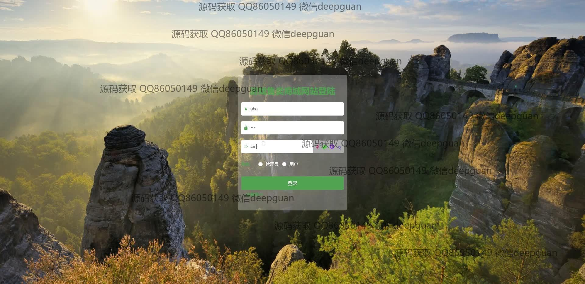
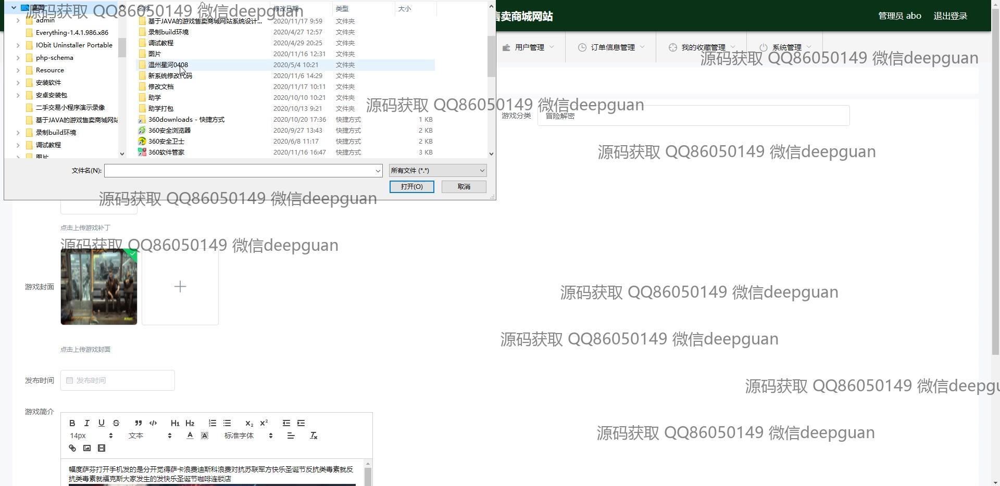

<h1 align="center">游戏攻略资讯补丁售卖商城vue</h1>

## 简介
游戏攻略资讯补丁售卖商城：角色分为管理员、用户；提供功能包括游戏信息管理、攻略管理、补丁管理、用户和订单管理、支付系统及客服管理等。基于Vue框架开发，界面简洁，用户体验良好。    --计算机毕业设计源码；毕设源码；java毕业设计源码

## 联系方式

<h3 align="center">获取完整代码与数据库文件 + 微信：deepguan QQ: 86050149 QQ群: 783742310</h3>

<h3 align="center">可帮忙远程部署 包运行成功！提供远程部署、修改代码、设计文档指导、代码讲解等服务！</h3>

## 功能介绍（完整见运行截图）
管理员：基本功能包括登录、注册和退出，提供管理各种信息的后台界面，如游戏分类、信息、攻略和补丁管理。此外，管理员可以查看和处理用户管理、订单信息管理、收藏管理、系统管理和客服管理。通过各模块的导航便捷地切换功能，支持详细、修改和删除的操作按钮便于管理每个项目。

用户：基本功能包括登录、注册和退出，允许用户在平台上浏览和购买游戏及相关补丁。用户可以通过标签进行游戏搜索，查看游戏详细信息、简介、价格以及攻略和补丁详情。在个人中心，用户可以修改个人信息、查看订单和收藏，并通过多种支付方式完成交易。导航栏提供快速访问不同模块的入口，如游戏信息、攻略、补丁和新闻资讯等。

## 运行截图

本代码来源于网络,仅供学习参考使用!

